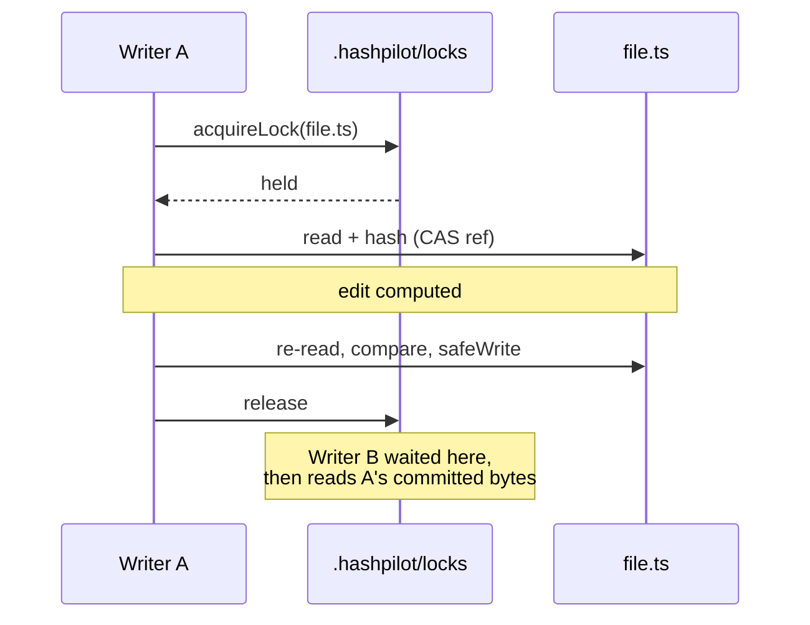

# HashPilot — Architecture & Design

A living document capturing the architecture, design decisions, and data flow of the HashPilot structured editing system.

**Landing page:** https://bigknoxy.github.io/HashPilot/ — problem statement, audience, quick start.

**Roadmap & backlog:** [../ROADMAP.md](../ROADMAP.md) — sprint-ordered work queue derived from [../AUDIT-2026-08.md](../AUDIT-2026-08.md). Several known defects described there contradict behavior documented on this page; the roadmap is authoritative on what is broken today.

---

## Why This Document Exists

HashPilot has two complementary docs that must always be kept in sync with the code:

| Document | Purpose | Audience |
|----------|---------|----------|
| **README.md** | Product landing page — what, why, quick start | Developers, agents, teams |
| **ARCHITECTURE.md** (this) | Design doc — how it works, why it's built this way | Engineers, contributors, reviewers |

**Verification rule:** Every PR that touches `src/` must update one or both docs. A CI check (`docs-verify`) validates that if `src/` files change, either `README.md` or `docs/ARCHITECTURE.md` must also change.

---

## Design Philosophy

1. **Correctness over cleverness** — Boring, readable solutions that are easy to maintain. Every edit should be verifiable.
2. **Smallest change that works** — Minimize blast radius. Don't refactor adjacent code unless it reduces risk.
3. **Leverage existing patterns** — Follow project conventions before introducing new abstractions.
4. **Cryptographic certainty** — SHA-256 content identity eliminates fuzzy matching. If the hash matches, you're editing the right content.
5. **Auto-recovery** — Stale anchors, failed verifies, race conditions. The system detects and recovers transparently.
6. **Auditability** — Every edit records who, what, when, and why. Provenance is a first-class concern.

---

## Module Architecture

```
┌──────────────────────────────────────────────────────────────────┐
│                        hashpilot CLI                        │
│                    (Commander-based, Bun runtime)                  │
├───────────┬───────────┬──────────┬──────────┬────────────────────┤
│   Read    │    AST    │   Hash   │   Diff   │  Verify + Batch    │
│   Search  │   Ops     │   Ops    │   Ops    │  + Intent + Route  │
├───────────┴───────────┴──────────┴──────────┴────────────────────┤
│                        Router (auto-select)                       │
│               chooseRoute(): AST → Hash → Diff                    │
│               routeEdit(): execute + telemetry + provenance        │
├──────────────────────────────────────────────────────────────────┤
│                     Cross-Cutting Layers                          │
│   • Telemetry (JSONL)     • Provenance (agent git blame)          │
│   • Config (env→CLI→project→global)  • Error/exit codes           │
│   • Doctor (health check)  • Batch (parallel/serial edits)        │
└──────────────────────────────────────────────────────────────────┘
```

**Telemetry timing:** Every CLI command measures `elapsed_ms` via `Date.now() - start`
recorded at command entry. This is enforced by a regression test that asserts no
command reports a hardcoded zero. Previously `replace-hash` hardcoded `elapsed_ms: 0`
(issue #51, defect #3), poisoning health-report averages since it is one of the
highest-frequency operations.

### Module Responsibilities

#### `src/cli-node.cjs` — Node-parseable Launcher
- The `bin` target for the published package. Deliberately plain CommonJS so any Node can parse it.
- Spawns `bun run src/cli.ts` with an **array** argv (never a shell string — edit payloads contain code, quotes, and newlines).
- Forwards Bun's exit status verbatim, preserving the 0/1/2/3/4/5/70 contract.
- Bun missing → one actionable install line on stderr and exit **127**, instead of a syntax-error stack trace ([#35](../../issues/35)).

#### `src/cli.ts` — CLI Entry Point (~750 lines)
- Commander-based command registration
- Every command wraps its action in `recordEvent({...})` for telemetry
- Subcommands: `read-many`, `read-hash`, `replace-hash`, `grep-many`, `symbol-lookup-many`, `ast *`, `diff *`, `route-edit`, `batch`, `intent`, `verify-changes`, `telemetry *`, `provenance *`, `doctor`, `config`, `upgrade`

#### `src/router.ts` — Route Selection & Dispatch
- `chooseRoute(file, operation)`: Determines AST vs Hash vs Diff based on:
  - File extension and language detection
  - Operation type (rename, replace, insert, etc.)
  - User-configured route policies that can override per language or per operation
  - Conflict resolution: `"language"`, `"operation"`, or `"strictest"`
- `routeEdit(file, operation, args)`: Unified execution entry point
  - Routes the edit, applies it, records telemetry event
  - Returns `{ route, success, error?, message? }`
- Route policy merge priority: env var → CLI flag → project config → global config → defaults

#### `src/ast-edit.ts` — Tree-Sitter AST Operations
- Tree-sitter parsing for TS, TSX, JS, Python, Go, Rust
- `.d.ts` files excluded from AST editing
- Operations:
  - `findSymbols(file)` — enumerate all functions, classes, methods, variables. Reports
    1-indexed `startLine`/`endLine`/`startColumn`/`endColumn` (matching the hash tier's
    `range` and `read-hash`) alongside the raw 0-indexed tree-sitter
    `startRow`/`endRow`/`startCol`/`endCol` kept for compatibility (#99).
  - `renameSymbol(file, oldName, newName)` — rename + all references via tree queries
  - `replaceBody(file, symbolName, newBody)` — replace function/method body
  - `addImport(file, specifier, source)` — add an import, merging into an existing
    statement for the same module rather than emitting a duplicate one. TS/TSX/JS
    merge named and default bindings into the existing clause (namespace imports
    have no merge form and still get their own statement); Python merges
    `from X import Y`; Go merges into an existing `import ( ... )` block. A binding
    already bound from that module — including under an alias — is refused with
    `changes: 0`. Type-only and value imports never merge into each other:
    `import type { .. }` erases its bindings at compile time, so folding a value
    import into one would silently delete it. A newly inserted statement consumes
    exactly one newline after the last import, so the blank line separating the
    import block from the code below it survives; when the last import ends at EOF
    with no trailing newline, one is opened so the statements never glue onto a
    single line (#103).
  - `removeImport(file, specifier)` — remove a binding or a whole import statement.
    Matching is against parsed binding tokens, not source substrings: a name that is
    one of several bindings is removed from the clause and the surviving bindings are
    rewritten; the statement is deleted only when nothing survives it. Accepts the bare
    name, the exact module path, and the full `{ X } from "mod"` / `from mod import X`
    forms. TS/TSX/JS, Python, Go, and Rust all take this path (#102).
  - `insertBefore(file, symbolName, content)` — insert content before symbol
  - `insertAfter(file, symbolName, content)` — insert content after symbol
- Per-language configs for import formatting and grouped import handling
- Returns `{ success, symbolFound, edits: SyntaxEdits[], error? }`

#### `src/hash-edit.ts` — SHA-256 Anchored Content Replacement
- `replaceHash(file, hash, content, options?)`:
  - Computes SHA-256 of target file content
  - Matches against provided hash
  - If match: performs the replacement at byte range
  - If stale: auto-recovers by re-reading the file
  - Returns `{ success, stale, newHash?, error? }`
- Stale-anchor recovery protocol:
  1. Read current file content and hash
  2. Match against expected hash
  3. If mismatch: report stale anchor, re-read, retry with new hash
- Critical for concurrent editing scenarios where two agents may edit the same file

#### `src/diff-engine.ts` — LCS-Based Unified Diff
- Longest Common Subsequence (LCS) algorithm
- Generates unified diffs (`diff -u` format)
- Applies patches with fuzzy matching, tolerance in lines (`fuzzyMatch`, default 3)
- `fuzzyMatch: 0` is **strict mode**: the hunk applies at exactly the recorded offset
  with exactly the recorded content, or it refuses. Strict mode also refuses a patch
  that has already been applied, so a retry cannot duplicate an inserted block
- The fuzzy window is `±fuzzy` lines around the recorded offset. It deliberately does
  not widen by the hunk body length, which used to let a hunk land a whole body away
  from where it was recorded and silently patch the wrong region ([#31](../../issues/31))
- Hunk bodies are consumed by the line counts the `@@` header declares rather than by
  scanning for the next marker: every body line is prefixed, so a removed line whose
  content starts with `-- ` renders as `--- ...` and a marker scan mistook file content
  for the next file header, truncating the hunk ([#31](../../issues/31))
- Duplicate detection: if oldContent matches multiple locations, fails with disambiguation hints
- Fallback route for unsupported languages and operations
- Covered by property tests (`tests/diff-property.test.ts`): `apply(diff(A,B)) === B` over a
  generated alphabet containing every reserved unified-diff token, plus empty and
  whitespace-only lines, repeated identical lines, CR characters, long lines, and
  astral-plane characters. Seeded for CI reproducibility; `FC_RANDOM_SEED=1` runs unseeded

#### `src/read.ts` — Batch & Contextual File Reading
- `readMany(files)`: Batch read files returning content + SHA-256 hashes
- `readHash(file, line)`: Read single line with surrounding context + hashes
- Both return structured JSON for agent consumption

#### `src/grep.ts` — Regex Search
- `grepMany(pattern, paths)`: System grep wrapper
- `symbolLookupMany(paths, names)`: Regex-based symbol definition search
- Compact, deterministic output

#### `src/intent.ts` — Intent-Based Editing (M5)
- Parses structured intents (e.g., `{"operation":"add-parameter","symbol":"fn","param":{"name":"x"}}`)
- Resolves symbol definitions and all call sites
- Generates an `EditPlan` with:
  - Ordered steps (definition first, then references)
  - Blast radius summary (how many files affected)
  - Prerequisite checks
  - `unresolved: UnresolvedItem[]` — work the planner could not compute, each with `{file, operation, reason, resolution}`
- Returns `{ success, plan: EditPlan, steps: EditStep[], error? }`
- **No invented source text (#16).** `add-parameter` without a `param.default`
  has no argument to pass at the call sites. The planner used to emit a C-style
  `/* TODO */` placeholder there — not a comment in Python, so a "successful"
  plan wrote a syntax error to disk. It now records an `unresolved` entry
  instead; the executor refuses the whole plan with `UNSUPPORTED_OPERATION`
  (exit 1) unless `--yes` is given, in which case only the computable steps run.


- **Tree-sitter reference resolution (#15).** \`findReferences\` was replaced by
 \`resolveReferences\`, which walks every parsable file in the project with the
 same \`getParser()\` as the AST route. A call site is a bare \`identifier\`/ \`type_identifier\` that is neither a declaration name, a member access, nor an
 import binding. Per-language \`REF_QUERIES\` cover TS/TSX/JS/Python/Go/Rust.
  The \`EditPlan\` now carries an optional \`reconciliation\` field
 (\`{resolved, unresolved, ambiguous}\`): \`unresolved\` counts files in
 languages HashPilot does not parse; \`ambiguous\` counts caller files that
 bind the same name multiple times; both trigger refusal via the
 \`plan.unresolved\` guard.

#### `src/plan-executor.ts` — Edit Plan Execution
- Executes `EditPlan` steps through the router
- Supports: dry-run mode, per-step verify, revert-on-failure
- `executeIntent(intentJSON)`: Top-level entry:
  1. Parse intent JSON
  2. Resolve symbols and references
  3. Generate EditPlan
  4. Execute through router
  5. Verify results
  6. Return `{ success, changeset, steps: [{file, operation, status, error?}] }`

**Rollback & verification invariants (issues #10, #17)**:
- Verification failure (`VerifyResult.overall === "fail"`), not just step failure, must
  trigger rollback when `revertOnFailure` is true. `PlanResult.success` reflects both
  dimensions; it is `false` when either the steps fail *or* the post-edit verification
  fails. The `errorCode` of `VERIFY_FAILED` maps to exit code 4.
- A half-reverted tree must never claim `reverted: true`. The revert loop now tracks
  every snapshot file whose `safeWrite` threw and returns them in `unrevertedFiles`.
  `reverted` is `true` only when every snapshot file was fully restored to its pre-edit
  state; otherwise `reverted: false` and `unrevertedFiles` names the files still in
  their post-edit state.
- **Verification is skipped entirely when a step has already failed.** The tree is
  half-applied at that point, so the suite would report failures that are a
  consequence of the incomplete edit, not findings about the change — at the cost of
  a full test run on work that is about to be reverted. It also used to corrupt the
  diagnosis: `errorCode` became `VERIFY_FAILED` (exit 4, "the edit applied but tests
  failed") when the edit had never applied at all (exit 2).
- **An incomplete rollback outranks every other error code.** `unrevertedFiles`
  being non-empty yields `ROLLBACK_INCOMPLETE`, which maps to exit **5** (I/O) rather
  than 4. Exit 4 sits in the band an agent reads as "your edit landed, the tests are
  red" — safe to retry. A half-reverted tree is not safe to retry, so it must not
  share that code.
- **The rollback snapshot's own read failures count as unreverted.** A file that
  could not be read when the pre-edit snapshot was taken has nothing to write back,
  so the revert loop — which iterates the snapshot — would neither restore it nor
  report it, reproducing the exact defect #17 closed on the write side. Such a file
  is folded into `unrevertedFiles` when a step actually modified it. Both the
  snapshot and the step read through `Bun.file().text()`, so today this requires the
  file to become readable between the two — a race window, not a reproducible path.
  It is guarded by construction so the invariant survives future step types.
- **The rollback decision reports *why* it fired.** `PlanResult.revertReason` carries
  `"verification-failed"` (every step applied but a check reported `overall: "fail"`)
  or `"step-failed"` (a step could not apply, so the tree is half-applied); it is
  absent when nothing was reverted (#10). This is what lets a caller tell a red
  verification (fix the check, then retry) apart from a broken plan. A verification
  *timeout* is its own verdict (`VERIFY_TIMEOUT`, exit 4) and never reverts, so it
  yields no `revertReason`.

#### `src/provenance.ts` — Edit History (M6)
- ChangeSet-based tracking (group of related edits)
- `provenanceQuery(file, line?)`: Shows edit history per file/line
- Like `git blame` for agent edits
- Records: actor, taskId, reason, timestamp, operation, file, hash
- Unified diffs are **opt-in** (`provenance.captureDiffs`, default off) and are
  never captured for files `isSensitiveFile` matches; hashes still record that
  the file changed

#### `src/paths.ts` — Write Boundary
- `assertWritable(path, opts)`: resolves symlinks, then requires the target to sit
  inside the project root (or an explicitly allowed root). Otherwise `PATH_DENIED`.
- Hard deny-list that no option can override: `~/.ssh`, `~/.aws`, `~/.gnupg`,
  `/etc`, shell startup files, and HashPilot's own telemetry log. Deny targets are
  themselves realpath-resolved (on macOS `/etc` is a symlink to `/private/etc`).
- Widened by `allowedRoots` in config or `--allowed-root`; disabled by `--allow-outside-root`.
- `safeWrite` is the single write path used by every edit route. It snapshots the
  file's pre-edit bytes, then writes atomically: sibling temp file → `fsync` →
  `rename` over the target → `fsync` of the directory, with the target's mode
  preserved. A crash mid-write leaves the original byte-identical, and orphaned
  `.hashpilot-tmp-*` files older than an hour are swept after each write.

#### `src/core/encoding.ts` — Byte Fidelity (#30)
- A structured editor's one non-negotiable property is that it must not change
  bytes it was not asked to change. Reading with `.split("\n")` and writing back
  with `.join("\n")` breaks that three ways: it deletes `\r` from every line of a
  CRLF file, folds a BOM into line 1 where it corrupts that line's hash, and drops
  or invents a trailing newline. A one-line edit then produces a whole-file diff.
- **Normalize at the boundary.** `decodeText(raw)` strips the BOM and converts
  CRLF/CR/LF to plain `\n`, returning that text plus a `FileEncoding` record
  (`bom`, dominant `eol`, per-line `endings` when the file was inconsistent,
  `trailingNewline`). Every tier — hashing, line splitting, AST offsets — operates
  on plain-LF text and never sees a `\r`. `encodeText(text, encoding)` puts the
  original layout back at write time. `readDecoded(path)` is the read-side entry
  point, used by `read.ts`, `hash-edit.ts`, `diff-engine.ts`, `plan-executor.ts`,
  and `router.ts`.
- **Write side.** `paths.ts` re-applies the *target file's* layout inside both
  `safeWrite` and `atomicWrite`. It re-decodes the incoming content first, so the
  transform is correct whether the caller handed back normalized text or text still
  carrying the file's endings, and applying it twice changes nothing. Encoding runs
  **before** `recordSnapshot`, or the snapshot would hash bytes that never reached
  disk and `undo` would fail its own verification.
- Trailing-newline presence follows the original file, not the edit: an agent
  handing back content without a final newline is describing lines, not asking to
  change how the file terminates. The one exception is emptying a file, which
  yields an empty file rather than a lone blank line.
- **Known limitation.** A mixed-ending file restores endings *by line position*, so
  lines after an inserted line take the ending that used to belong to the line at
  that index. Lines the edit created take the dominant style. Consistent files —
  effectively all real ones — are unaffected.
- Astral-plane content is safe without special handling: tree-sitter node
  `startIndex`/`endIndex` are UTF-16 code units, matching JS string offsets, so
  emoji and CJK Extension B characters do not shift AST edits.

#### `src/core/path-normalize.ts` — Path Canonicalization for Comparison (#41)
- `normalizePath(file)` resolves `./`, `../`, and trailing slashes, then expresses
  the result **relative to `process.cwd()`** when it lives underneath it, and
  leaves it absolute otherwise. `pathsEqual(a, b)` is the normalized comparison.
- Used by `intent.ts` to dedupe plan steps. Without it, the same file reached via
  `src/a.ts`, `./src/a.ts`, and `/abs/proj/src/a.ts` produced one plan step per
  spelling, and a reference spelled differently from the definition escaped the
  `!== definition.file` filter and got renamed twice.
- **Deliberately separate from `paths.ts`.** That module is the write boundary and
  must not accumulate comparison helpers — a permissive canonicalizer sitting next
  to `assertWritable` invites using it where a realpath check is required.
- **Not interchangeable with lock keys.** Output is cwd-relative, so it is only
  valid for comparisons made within a single process at a fixed cwd. Persisted or
  cross-process keys must stay cwd-independent — see `locking.ts` below.

#### `src/core/locking.ts` — Advisory Locks and Concurrency (#21 / B18)
- Lockfiles under `<project root>/.hashpilot/locks/`, named by a SHA-256 of the
  **absolute** target path, holding `{pid, nonce, ts, targets}`.
- **Both halves of the lock path must be cwd-independent.** The directory is
  anchored to the *target file's* project root, not to `process.cwd()`: a
  cwd-relative directory combined with an absolute key means two agents editing
  one file from different working directories write to different lockfiles and
  exclude nobody. The key is a cryptographic hash rather than a 32-bit string
  fold, whose collisions made unrelated files share a lockfile — and since locks
  are not re-entrant, a collision inside one batch self-deadlocks until timeout.
- **Acquisition is atomic.** The lockfile is created with `O_CREAT|O_EXCL`
  (`writeFileSync` flag `wx`), so the existence check and the create are one
  syscall. An `existsSync` guard followed by a plain write is check-then-act:
  two processes can both observe no lockfile and both write.
- **The heartbeat is real.** A held lock refreshes its `ts` every 5s on an
  `unref`'d timer. Reclaim requires *both* a heartbeat older than 30s and a dead
  PID. Without the refresh, any lock held longer than the threshold was stealable
  from a live, working holder.
- **Release is ownership-checked.** Each acquisition mints a `nonce`; release
  unlinks only a lockfile still carrying it. A blind unlink-by-path would delete
  the lockfile of whoever reclaimed and re-acquired after us, handing a third
  writer the same file.
- Waiting always yields (50ms) between attempts rather than spinning, so a waiter
  does not burn a core starving the very edit it is waiting on.
- `acquireLock(file)` for a single file; `acquireSortedLocks(files)` sorts and
  dedupes **by lock path** (not by input path) so two plans touching `{A,B}` and
  `{B,A}` cannot deadlock and no set can block against itself.
- `pruneStaleLocks(root?)` sweeps reclaimable leftovers from crashed processes.
- **Compare-and-swap is necessary but not sufficient.** CAS re-reads the file and
  compares hashes before writing, but between that compare and `safeWrite` another
  writer can land — and CAS then reports success over an edit it never saw. So
  `routeEdit` holds the lock across the entire read → edit → compare → write
  window; CAS is checking a snapshot nobody else can invalidate.
- **Locks are deliberately not re-entrant.** Refcounting by path would let two
  genuinely concurrent writers *inside one process* both "hold" the lock, which is
  the lost update the lock exists to prevent. `batch-edit` already locks its whole
  file set up front, so it passes `alreadyLocked: true` to the router rather than
  nesting an acquire that would wait on itself until the timeout.
- Release functions are idempotent: a `finally` that runs twice must not unlink a
  lockfile a later acquirer now owns.
- A contended lock surfaces as a retryable `LOCK_TIMEOUT` (exit 3), not a hard
  edit failure, so callers reuse the retry path they already have. It is
  deliberately *not* reported as `STALE_ANCHOR`: that code tells the caller to
  re-read the file, which changes nothing here, and it inflated the stale-anchor
  health metric. `batch-edit` reports the same code for the same condition.



#### `src/snapshot.ts` — Pre-Edit Snapshots and Undo (#12)
- Content-addressed store at `~/.agentic-tools/snapshots/` (`objects/<sha256>` +
  `index.jsonl`), outside the project tree so it never appears in `git status`.
- Keyed by changeSet ID — the CLI mints one per invocation via `createChangeSet()`,
  so every write in one command undoes as a unit.
- `undoChangeSet(id, {force, dryRun})` restores the pre-*first*-edit bytes per file,
  removes files the changeSet created, and refuses any file whose current hash no
  longer matches what the edit wrote (`HASH_MISMATCH`, exit 3) unless `--force`.
- An undo is not itself snapshotted, so `undo --last` cannot ping-pong.
- Retention: 200 changeSets / 7 days by default, pruned on every invocation;
  configurable under `snapshots` in `.hashpilot.json`.

#### `src/exit-codes.ts` — Agent-Facing Exit Contract
- Maps `ErrorCode` → process exit code: `0` ok, `1` usage, `2` edit failed,
  `3` stale/precondition (retryable), `4` verify failed, `5` I/O, `70` internal.
- `finish(payload)` prints JSON and sets the code; batch commands take the worst.

#### `src/redact.ts` — Credential Scrubbing
- `redactSecrets(text)`: replaces credential shapes (AWS, OpenAI, Anthropic,
  GitHub, Slack, Google, JWT, private-key blocks, auth headers, connection-string
  passwords, and secret-named assignments) with `[REDACTED]`.
- `isSensitiveFile(path)`: basename denylist (`.env*`, `*.pem`, `*.key`, `id_rsa`,
  `credentials`, `.npmrc`, `.netrc`, `secrets.*`) used to suppress diff capture.
- `redactEvent(event)`: recursive walk applied to every telemetry record.

#### `src/telemetry.ts` — Structured JSONL Logging
- Logs to `~/.agentic-tools/logs/` (dir `0700`, file `0600`; older logs tightened on write)
- Kill switch, highest priority first: `--no-telemetry` → `HASHPILOT_TELEMETRY=0`
  → `telemetry.enabled` in config → on
- Every record passes through `redactEvent` before it is written
- Every CLI command records: operation name, route, file, language, success, elapsed_ms
- Health reports with threshold warnings:
  - Stale-anchor rate (warns >10%)
  - Diff fallback rate (warns >15%)
  - Verify failure rate (warns >5%)
  - Per-language failure rate (warns >10%)
- Trend comparison: compares current window vs previous window
- Sessions: group events by session ID

#### `src/verify.ts` — Verification Bundling
- `verifyChanges(files, options)`: Run checks on specified files
- All checks opt-in via CLI flags
- Auto-detects tools from:
  - `package.json` (lint-staged, eslint, prettier, typescript, jest, vitest, bun:test)
  - `pyproject.toml` (ruff, mypy, pytest)
  - `go.mod` (gofmt, go vet)
  - `Cargo.toml` (cargo fmt, cargo clippy, cargo test)
- Revert-on-failure: if verify fails, undo the edit
- **Binary allowlist (B19).** Verification spawns tools, so the command string is
  an execution surface. Commands are split on whitespace and spawned as an argv
  array — never through a shell — and the executable is checked three ways:
  - A bare name must be on the allowlist (`prettier`, `tsc`, `pytest`, …).
  - A *path* is resolved with `realpathSync` and must land in the project's own
    `node_modules/.bin`. Matching on the basename instead let `/tmp/evil/tsc`
    through: an allowlisted name on a file the caller chose to place there.
  - Arguments are checked too. Several allowlisted tools have a flag that turns
    them into a general-purpose interpreter (`node -e`, `python -c`, `go run`,
    `bun -e`, `npx --call`), which defeats the allowlist entirely; those are
    denied on any argument position.
- `--allow-arbitrary-tool` bypasses all three, and logs a `WARNING` naming the
  command so an audit can tell a vetted tool from a bypassed one.
- **Scoping, baselines, and timeouts (#24).** Verification used to run the whole
  suite and treat any red as "your edit broke this", which meant an unrelated
  pre-existing failure could drive `--revert-on-failure` into deleting correct
  work. Three changes close that:
  - `src/verify-scope.ts` — `buildTestInvocation()` narrows the run to the tests
    related to the changed files, per runner (`jest --findRelatedTests`,
    `vitest --related=`, changed/convention-derived test files for `bun test`
    and `pytest`, per-package `./dir` for `go test`, `--test <name>` for
    `cargo test` when every change is an integration test). Every result reports
    `testScope.scoped` and a `reason`, so an unscoped fallback is visible rather
    than silent. `parseFailures()` extracts individual test names and returns
    `null` — never an empty list — when the output shape is unrecognised. Its
    jest/vitest file marker is `FAIL` only: `✗` also prefixes a failing test
    name, and matching it as a filename swallowed every failure on that line.
  - `src/verify-baseline.ts` — a pre-edit run of the same scope, cached under
    `~/.agentic-tools/verify-baselines/` keyed by root + commit SHA + runner +
    scope signature. `recordVerifyBaseline()` is called by `plan-executor` on the
    pristine tree (the only honest moment) and exposed as `--record-baseline`.
    With `--use-baseline`, only tests that were *not* already failing count.
    Every uncertainty — missing baseline, runner mismatch, scope mismatch,
    unparseable output — resolves to `comparable: false`, so a doubtful baseline
    makes the caller re-check rather than suppressing a real regression.
  - Timeouts are their own outcome: `overall: "timeout"` with
    `ErrorCode.VERIFY_TIMEOUT` (still exit 4), excluded from both the verify
    revert and the plan rollback. A check that never reached a verdict is
    evidence of nothing. Child output is drained from stdout and stderr
    concurrently, retaining 256 KB but reading past it, so a chatty tool cannot
    deadlock on a full pipe and masquerade as a timeout.

#### `src/config.ts` — Layered Configuration
- Merge priority: env var → CLI flag → project `.hashpilot.json` → global `~/.config/hashpilot/config.json` → defaults
- Route policies can override routing per language or per operation
- Config schema validated at load time

#### `src/doctor.ts` — Installation Health Check
- Verifies: core files exist, CLI is on PATH, config is valid
- Checks adapter integrations: Claude Code, OpenCode, Pi
- Reports: installation status, missing components, version info
- Single command: `hashpilot doctor`

#### `src/batch-edit.ts` — Batch Editing
- `editMany(operation, files)`: Same edit applied to many files in parallel
- `editManySerial(operation, files)`: Serial execution for dependent operations
- Parallel mode uses `Promise.all` for concurrent file processing

#### `src/core/operations.ts` — Operation Registry (#25)
- One declarative list of every operation both front doors expose: name, CLI command, params, and handler
- MCP tool schemas are generated from it, so the MCP surface cannot silently drift from the documented CLI
- Every handler delegates to `routeEdit`, so an MCP caller gets the same locking, compare-and-swap, snapshot, and provenance guarantees a CLI caller does
- `tests/operations-parity.test.ts` drives the real Commander `--help` tree and asserts every registry param exists as a real CLI flag or argument

#### `src/mcp/server.ts` — MCP Server (#25)
- Newline-delimited JSON-RPC 2.0 over stdio, protocol revision `2024-11-05`; no SDK dependency
- Methods: `initialize`, `notifications/initialized`, `ping`, `tools/list`, `tools/call`
- Protocol errors (`-32700`/`-32600`/`-32601`/`-32603`) are the host's to handle; a failed edit comes back as `isError: true` on a successful result, for the model to read and recover from
- Requests are handled strictly in order: the advisory lock is not re-entrant, so concurrent handling would deadlock
- `hashpilot mcp --stdio` owns stdout for the whole process — it is the one command that emits no JSON envelope
- Host setup: [INTEGRATION-MCP.md](INTEGRATION-MCP.md)

#### `src/index.ts` — Barrel File
- Re-exports all public API surface from core modules

---

## Data Flow

### The Canonical Edit Cycle

```
  READ                     EDIT                        VERIFY
  ┌─────┐                 ┌───────┐                   ┌───────┐
  │     │   hash + content │       │   edit result      │       │
  │ src/ ├────────────────▶│ route │───────────────────▶│ verify│
  │ .ts  │                 │ .edit │                    │ .ts   │
  │     │ ◀────────────────│       │                   │       │
  └─────┘  stale? re-read  └───────┘                   └───────┘
                                                             │
                                   ┌─────┐                   │
                                   │     │    pass            │
                                   │ done│◀───────────────────│
                                   │     │                   │
                                   └─────┘                   │
                                                             │ fail
                                                             ▼
                                                        ┌─────────┐
                                                        │ revert  │
                                                        └─────────┘
```

### Intent Flow (Multi-File)

```
  ┌────────┐    ┌───────────┐    ┌──────────┐    ┌──────────────┐
  │ intent │───▶│  resolve  │───▶│  plan    │───▶│  execute      │
  │ parse  │    │  symbols  │    │  steps   │    │  (via router) │
  └────────┘    │ discover  │    └──────────┘    └──────┬───────┘
                │ refs     │                      │
                └───────────┘                      ▼
                                              ┌─────────┐
                                              │ verify  │
                                              │ steps   │
                                              └─────────┘
```

---

## Edit Lifecycle (Step by Step)

1. **Agent reads** a file via `read-many` → gets content + SHA-256 hash
2. **Agent calls** `route-edit` (or `replace-hash`, `ast rename-symbol`, etc.)
3. **Router determines** the best strategy:
   - AST route: for supported languages + operations, tree-sitter guarantees structural validity
   - Hash route: for all other cases, SHA-256 anchor guarantees content identity
   - Diff route: fallback, LCS-based with fuzzy matching
4. **Edit is applied** — returns success/failure + new hash if applicable
5. **Telemetry records** the event (operation, route, file, language, success, elapsed_ms)
6. **Provenance records** the change (actor, taskId, reason, timestamp)
7. **(Optional) Verify** runs format + lint + typecheck + tests
8. **(Optional) Auto-revert** if verify fails

---

## Key Design Decisions

### 1. Tree-sitter for AST (not Babel, not TypeScript Compiler API)
- **Why:** Tree-sitter is incremental, fast, and supports multiple languages in one library. Babel/TypeScript are JS-only and require full project context. Tree-sitter queries are declarative and composable.
- **Cost:** Limited to 6 languages. Rust/Go work well; no Java, Kotlin, Swift, C#, or PHP support yet.
- **Mitigation:** Hash and Diff routes cover all languages. AST is a best-effort optimization, not a requirement.

### 2. SHA-256 for Content Identity (not line numbers, not CRC)
- **Why:** SHA-256 is the standard for content verification. Collision-resistant, fast, and universally understood. Line numbers drift. CRCs are weak.
- **Cost:** Must read the file to compute the hash. Cannot hash without I/O.
- **Mitigation:** `read-many` returns both content and hash in one call. Cached by the agent.

### 3. LCS for Diff (not Myers, not Patience)
- **Why:** LCS is simple, well-understood, and sufficient for search-and-replace with fuzzy matching. Myers and Patience are better for human diffs but overkill for machine-driven replacements.
- **Cost:** O(n²) on old+new content size. Long files with many changes hit quadratic behaviour.
- **Mitigation:** Content lengths are bounded by file size; typical edits are small (1-50 lines).

### 4. 3-Tier Routing (not just one strategy)
- **Why:** No single strategy works for all files and all edits. AST requires a supported language. Hash requires knowing the old content. Diff is the catch-all.
- **Cost:** Routing logic adds complexity to the codebase.
- **Mitigation:** The router is a simple decision tree (~100 lines). Defaults are safe for all cases.

### 5. Telemetry-First Design (not bolt-on)
- **Why:** AI agents are non-deterministic. Telemetry is the only way to know if edits are working correctly. Every CLI command records an event.
- **Cost:** Logs to `~/.agentic-tools/logs/` — disk usage proportional to usage.
- **Mitigation:** Health reports provide actionable signals (stale-anchor rate, diff-fallback rate).

### 6. Provenance as First-Class Concern (not afterthought)
- **Why:** AI-generated changes need audit trails. Teams need to know which agent changed what and why.
- **Cost:** Every edit records additional metadata. Adds storage overhead.
- **Mitigation:** Provenance data is queryable per file/line — indexed for fast retrieval.

---

## Language Support Matrix

| Language | Extensions | AST Ops | Hash Ops | Diff Ops |
|----------|-----------|---------|----------|----------|
| TypeScript | `.ts` (not `.d.ts`) | All 7 | ✓ | ✓ |
| TSX | `.tsx` | All 7 | ✓ | ✓ |
| JavaScript | `.js`, `.jsx`, `.mjs`, `.cjs` | All 7 | ✓ | ✓ |
| Python | `.py` | All 7 | ✓ | ✓ |
| Go | `.go` | All 7 | ✓ | ✓ |
| Rust | `.rs` | All 7 | ✓ | ✓ |
| Any other | any | — | ✓ | ✓ |

---

## Configuration Reference

```json
{
  "routePolicy": {
    "languageOverrides": {
      "python": "hash",
      "javascript": "ast"
    },
    "operationOverrides": {
      "add-import": "diff",
      "replace-body": "ast"
    },
    "conflictResolution": "operation"
  },
  "telemetry": {
    "enabled": true,
    "logDir": "~/.agentic-tools/logs"
  },
  "provenance": {
    "enabled": true,
    "storageDir": "~/.agentic-tools/provenance"
  }
}
```

Merge priority: `env var` → `CLI --config` → `.hashpilot.json` → `~/.config/hashpilot/config.json` → defaults.

Route policies:
- `languageOverrides`: force a route for a specific language (e.g., Python → hash)
- `operationOverrides`: force a route for a specific operation (e.g., add-import → diff)
- `conflictResolution`: when language and operation rules conflict — `"language"`, `"operation"`, or `"strictest"` (the most restrictive wins)

---

## Adapters

HashPilot integrates with three coding agent platforms via the [Adapter Contract](ADAPTER-CONTRACT.md):

| Platform | Mechanism | Files |
|----------|-----------|-------|
| **Claude Code** | CLAUDE.md injection | `~/.claude/CLAUDE.md` + agent bindings |
| **OpenCode** | Skill + subagent | `~/.config/opencode/skills/hashpilot/` + `~/.config/opencode/agent/hashpilot.md` |
| **Pi** | Native extension | `~/.pi/agent/extensions/hashpilot.ts` + 7 custom tools |

Each adapter teaches the agent to use `hashpilot` commands instead of raw file editing.

---

## Telemetry & Health

### Event Schema
```json
{
  "ts": "2026-06-11T20:12:45Z",
  "operation": "replace-hash",
  "route": "hash",
  "file": "src/main.ts",
  "language": "typescript",
  "success": true,
  "elapsed_ms": 42,
  "actor": "claude",
  "taskId": "abc123",
  "reason": "Refactor port to config"
}
```

### Health Thresholds
| Metric | Warning | Critical |
|--------|---------|----------|
| Stale-anchor rate | >10% | >25% |
| Diff fallback rate | >15% | >30% |
| Verify failure rate | >5% | >15% |
| Per-language failure | >10% | >20% |

### Trend Tracking
Health reports compare the current window against the previous window (same duration). Worsening trends are flagged even if absolute rates are below thresholds.

---

## Error Handling

### Error Codes
| Code | Meaning | Recovery |
|------|---------|----------|
| `PARSE_ERROR` | Could not parse file | Fall back to hash route |
| `SYMBOL_NOT_FOUND` | Symbol not in tree | Fall back to hash route |
| `STALE_ANCHOR` | Hash mismatch (file changed) | Auto-recover: re-read and retry |
| `FILE_NOT_FOUND` | File does not exist | Return error to agent |
| `UNSUPPORTED_LANGUAGE` | AST not available | Fall back to hash route |
| `AMBIGUOUS_MATCH` | Diff found N > 1 matches | Return disambiguation hints |
| `VERIFY_FAILED` | Post-edit verification failed | Auto-revert (if configured) |

### Recovery Strategy
- **Stale anchors:** Re-read the file, compute new hash, retry the edit. If still stale, report error.
- **Failed verifies:** If `--revert-on-fail` is set, undo the edit. Otherwise, return error with verify output.
- **Parse errors:** Router automatically falls back down the tier (AST → Hash → Diff).

---

## Future Directions

### Planned
- **More AST languages:** Java, Kotlin, PHP, C#, Swift (blocked on tree-sitter grammar quality)
- **Batch verification:** Parallel verify across changed files
- **Provenance UI:** Web-based timeline of agent edits

### Exploratory
- **Intent library:** Pre-built intents for common refactoring patterns
- **Learning mode:** Telemetry-driven route optimization (auto-select best route based on success rates)
- **Stale-anchor prediction:** Warn before stale anchor occurs (based on file change frequency)

---

## Post-Deploy Verification

Every deploy to GitHub Pages **must** be verified with browser automation:

```yaml
# In gh-pages.yml — after peaceiris/actions-gh-pages
- name: Verify site with browser automation
  run: |
    SITE_URL="https://bigknoxy.github.io/HashPilot/"
    agent-browser open "$SITE_URL"
    agent-browser wait --load networkidle
    TITLE=$(agent-browser eval "document.title")
    HAS_PILOT=$(agent-browser eval "document.body.innerText.includes('HashPilot')")
    if [ "$HAS_PILOT" = "true" ]; then
      echo "✓ Site verified — $TITLE"
    else
      echo "✗ Verification failed"
      agent-browser screenshot /tmp/deploy-failed.png
      exit 1
    fi
    agent-browser screenshot /tmp/deploy-verified.png
    agent-browser close
```

**Why:** `curl` alone cannot verify JavaScript-rendered SPAs, console errors, or layout issues. Browser automation catches: broken assets, missing content, JS errors, incorrect routing, and visual regressions.

**Rule:** A deploy is not complete until browser verification passes with evidence (screenshot + text assertion). The verification must check for the correct branding/content on the live URL.

---

## How to Update This Document

1. **When adding a new module:** Update the Module Architecture section. Add the module file to the table.
2. **When changing routing logic:** Update the Router description. Note any new route policies.
3. **When adding a new language:** Update the Language Support Matrix.
4. **When changing the edit cycle:** Update the Data Flow section.
5. **Every PR that touches `src/`:** Confirm that README.md and/or ARCHITECTURE.md reflects the change.
6. **After every deploy:** Browser-verify the live site (see Post-Deploy Verification above).

The CI check `docs-verify` enforces rule 5 — if `src/` files change but neither landing nor design doc changes, the PR fails.

---

_Last updated: 2026-08-19 — Sprint 1 (safety hardening: write boundary, exit codes, telemetry opt-out, anchor relocation) · agent ergonomics ([CLI quickref](CLI-QUICKREF.md) generated from `--help`, roadmap consistency lint). Telemetry queries are reads: they exit 0 on success regardless of the `success` field of the events they return, and `readEvents(0)` returns nothing rather than the whole log. A log that exists but cannot be read now raises `READ_FAILED` (exit 5) instead of reporting a broken store as an empty one, and malformed JSONL lines are counted and warned about on stderr rather than silently dropped ([#59](../../issues/59)). `read-hash` now emits a 12-character `lineHash` — the same width `replace-hash` compares against — so the read → write round-trip no longer fails with a retryable `STALE_ANCHOR` ([#60](../../issues/60)). **Breaking (apiVersion 1):** every command now writes one envelope — `{ apiVersion, ok, command, data, error, warnings }` — validated against [`schema/hashpilot-envelope.schema.json`](../schema/hashpilot-envelope.schema.json) by a sweep over every leaf command; `ok` is derived from the exit code so the two cannot disagree, and route fallbacks, relocated anchors, and corrupt telemetry lines ride `warnings` instead of being invisible ([#18](../../issues/18), [#56](../../issues/56)). The AST tier no longer has a 32KB ceiling — sources are streamed to tree-sitter in chunks rather than marshalled through the binding's fixed string buffer, which used to throw `Invalid argument` and silently demote every large file to the diff route ([#55](../../issues/55)) — and all three tiers now run a parse-validity gate: a file that does not parse is refused before any offsets are computed, and every edit is reparsed before the write so a corrupting edit is discarded rather than saved ([#13](../../issues/13)). Every write is now atomic (temp file → fsync → rename, mode preserved) and pre-edit bytes are snapshotted to a content-addressed store, so `changesets` lists undoable units and `undo <id>` / `undo --last` restores them — refusing files changed since the edit unless `--force` ([#12](../../issues/12)). The intent planner no longer writes placeholder comments into source: an edit it cannot compute is reported as `plan.unresolved` and the plan is refused with `UNSUPPORTED_OPERATION` rather than half-applied ([#16](../../issues/16)). An empty-string `newContent` is now a deletion rather than a missing argument across every tier and entry point — the hash and diff route guards, the `route-edit`/`batch` `--new-content` resolver, and `read-hash`'s blank-line range check all used truthiness, which made deleting a region impossible and made blank lines unanchorable ([#40](../../issues/40)). Compare-and-swap is now backed by an advisory lock held across the whole read → edit → compare → write window, closing the single-file TOCTOU that let a concurrent writer land between the hash compare and the write while CAS still reported success; the lock is intentionally non-re-entrant and `batch-edit` signals `alreadyLocked` rather than nesting ([#21](../../issues/21)). The published `bin` is now a Node-parseable CommonJS shim that hands off to Bun and forwards its exit status, so `npm i -g hashpilot` on a machine without Bun yields an actionable message and exit 127 instead of a syntax error; CI packs the tarball and asserts this on a Node-only runner ([#35](../../issues/35)). The diff engine is now covered by seeded property tests: `apply(diff(A,B)) === B` asserted byte-for-byte over an alphabet carrying every reserved unified-diff token, which found two real defects -- hunk bodies were terminated by scanning for the next `--- ` marker, so a removed line whose content began with `-- ` truncated the hunk, and the fuzzy match window widened by the hunk body length, letting a hunk land a body away from its recorded offset. `fuzzyMatch: 0` is now strict mode with defined semantics: exact offset, exact content, and refusal of an already-applied patch ([#31](../../issues/31)). `remove-import` no longer deletes an entire import statement because `importSpec` happened to appear somewhere in its text: removing `statSync` from `import { readFileSync, writeFileSync, statSync } from "node:fs"` used to delete all three bindings and report `changes: 1`, while `"fs"` matched `from "node:fs"` and `"read"` matched `readFileSync`. TS/TSX/JS, Python, and Go now get the binding-level treatment Rust already had, and the documented full spec form (`{ X } from "mod"`) is accepted instead of failing ([#102](../../issues/102)). `add-import` was the mirror-image defect: it never merged, so an agent adding one name at a time accumulated one duplicate `import ... from "node:fs"` per call while every call reported success, and the insertion consumed the blank line under the import block so the new statement was glued to the declaration below it. Both are fixed, and the bench now reports **0 silent corruptions across 27 cases (100% correctness)** ([#103](../../issues/103)). Review of that fix caught two further silent corruptions, both now guarded by bench cases: a value import merging into `import type { .. }` (whose bindings are erased at compile time, so the added binding vanished from the output), and an insertion after a last import ending at EOF without a trailing newline, which glued both statements onto one line._
